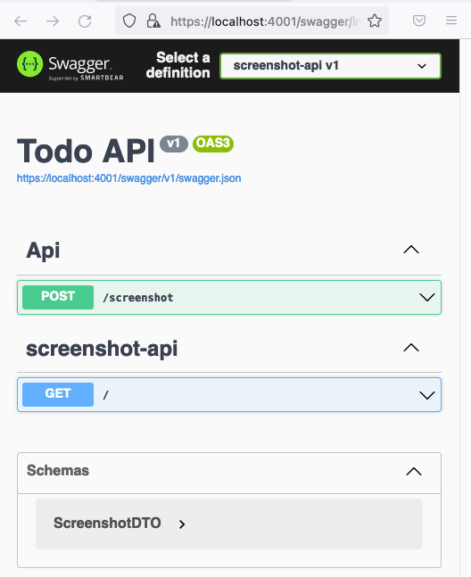
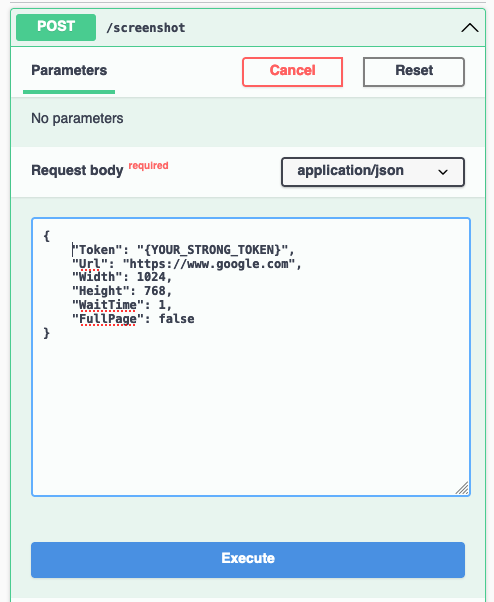

# Screenshot API
> This API is to take screenshots and return it in a byte array.

## How to build/run it

You need to define some environment variables, such as:
```
TOKEN="0d1ced54b210455a8397d019096af80c"
WARMINUP_URL="https://1.1.1.1/"
USER_AGENT="Mozilla/5.0 (Windows NT 10.0; Win64; x64) AppleWebKit/537.36 (KHTML, like Gecko) Chrome/99.0.4844.84 Safari/537.36"
CHROMIUM_EXECUTABLEPATH="/usr/bin/chromium"
```
In a `.env` file at project root, or in the file `launchSettings.json`.

You can run using `Visual Studio 2022`,

Or using the CLI of dotnet:
```sh
cd screenshot-api
dotnet dev-certs https --trust 
dotnet restore 
dotnet run
```

Or using `docker-compose`:
```sh
docker-compose -f docker-compose-dev.yml up
```

## How to use it

You can call it, e.g. using `curl` tool:
```sh
curl --location --request POST 'https://{YOUR_API_URL}/screenshot' \
--header 'Content-Type: application/json' \
--data-raw '{
    "Token": "{YOUR_STRONG_TOKEN}",
    "Url": "https://www.google.com",
    "Width": 1024,
    "Height": 768,
    "WaitTime": 1,
    "FullPage": false
}' >> image.jpeg
```
In the previous example take the screenshot of the page: `https://www.google.com` with the resolution `1024x768`, and store it in the file `image.jpeg`

Or you can use `swagger` locally: https://localhost:4001/swagger/index.html



